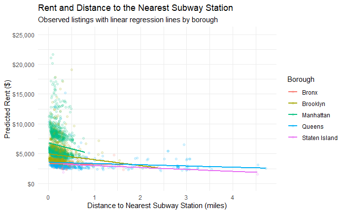

# Introduction

For New York City renters, subway access is part of the price of a home. A nearby station may shorten commutes and widen access to jobs, schools, services, and social life. It is also the case where a longer walk may be acceptable if it accompanies lower rent. Landlords, renters, and housing researchers therefore have reason to understand not whether transit access *causes* rent, but how strongly rents and access are associated in the current advertised market.

This relationship is not self-evident. Listings near stations are concentrated in boroughs and neighborhoods with very different housing stocks, and rents also vary with apartment size. A citywide average may consequently combine a transit-access pattern with large geographic differences. We ask the following research question. **Among New York City rental listings in May 2026, what is the descriptive relationship between advertised monthly rent and straight-line distance to the nearest subway station, and how does that relationship change when apartment size and borough are included?**

# Data, Wrangling, and Operationalization

Rental data come from the [FirstMover Open Data Project](https://www.firstmovernyc.com/open-data), which records a listing when it first appears on the market. Each row is an advertised rental listing, not a completed lease, and the asking rent does not incorporate later price or status changes. We retain listings in the five New York City boroughs from the May 2026 file. Station names and centroid coordinates come from the [MTA Subway Stations dataset](https://data.ny.gov/Transportation/MTA-Subway-Stations/39hk-dx4f), published through New York State Open Data.

The version-controlled pipeline downloads both sources, selects and renames relevant fields, and computes the Haversine distance from every listing coordinate to every station centroid. The closest centroid defines each listing's nearest station and distance. We randomly reserved 30% of the 20,385 geocoded NYC listings for exploration and used it to choose cleaning rules, transformations, and model specifications. That process selected `m3_loglog` as the final model. We then applied that exact specification to the untouched 70% confirmation portion. All reported inferential results use confirmation listings with complete values for every `m3_loglog` variable.

Our outcome, **advertised monthly rent**, operationalizes the price visible to renters. That is, it does not measure negotiated rent, total housing cost, or lease quality. Our focal input, **subway distance**, is straight-line meters to a station centroid. This is reproducible but imperfect because it is neither walking distance nor time, and a centroid may differ from the nearest entrance. We treated impossible zero square footage and net-effective rent values as missing. To avoid giving relisted apartments excess weight, we retained one row per URL and then one row per borough-street-unit combination, removing 128 repeated URLs and 14 further repeated units across the full dataset. This yielded 20,243 listings before complete-case filtering. Because `m3_loglog` includes square footage and that field is frequently missing, the confirmation analysis represents the subset of listings with complete model data rather than every confirmation listing.

The confirmation sample contains 3,101 listings. Its median advertised rent is \$4,634. The interquartile range is \$3,495 to \$6,500. Median subway distance is 311 meters. Its interquartile range is 187 to 493 meters. Borough sample sizes and rent distributions differ substantially. Staten Island estimates should be interpreted cautiously because few listings are represented.

\newpage

# Visualization

{#fig-main width="96%"}

@fig-main displays the fitted relationship between rent and subway distance for all five boroughs. Predicted rent declines as distance increases, while the vertical separation between lines reflects the borough adjustments in the final model. The lines are based on the same apartment profile so that borough and subway distance can be compared consistently. The Staten Island relationship should be interpreted cautiously because very few complete-case listings are represented.

\newpage

# Models and Results

Our initial unadjusted regression is

$$\text{Rent}_i = \beta_0 + \beta_1(\text{Distance}_i) + \epsilon_i,$$

which summarizes the unconditional relationship in dollars per additional meter. Exploratory plots showed long right tails in rent and distance. Among the transformation alternatives, `m3_loglog` had the strongest fit and better residual behavior. We therefore locked it as the final descriptive specification before examining the confirmation results.

$$\log(\text{Rent}_i)=\beta_0+\beta_1\log(\text{Distance}_i)+
\beta_2\text{Bedrooms}_i+\beta_3\text{Bathrooms}_i+
\beta_4\text{Square Feet}_i+
\boldsymbol{\gamma}^{\prime}\text{Borough}_i+\epsilon_i.$$

The log-log coefficient is an elasticity, making the magnitude interpretable across the observed distance range. The additional variables do not turn the model into a causal estimate. That is, they describe how the focal relationship differs after accounting for basic apartment composition and broad geography. We report heteroskedasticity-consistent HC1 standard errors because rent dispersion is not constant.

During exploration, we also replaced borough with neighborhood indicators. This produced 139 neighborhood groups within a much smaller complete-case sample. Many groups contained very few listings, which made the specification parameter-heavy and the individual neighborhood estimates unstable. We therefore did not select the neighborhood model. The final `m3_loglog` specification uses borough indicators as the more stable geographic adjustment.

| Quantity       |     Simple model | Final `m3_loglog` |
|:---------------|-----------------:|------------------:|
| Constant       |  5914.92 (66.59) |   7.7473 (0.0614) |
| Distance       | -0.8694 (0.0589) |  -0.0714 (0.0064) |
| Bedrooms       |               -- |   0.0403 (0.0191) |
| Bathrooms      |               -- |   0.3082 (0.0320) |
| Square feet    |               -- | 0.00028 (0.00009) |
| Brooklyn       |               -- |   0.2997 (0.0353) |
| Manhattan      |               -- |   0.6367 (0.0346) |
| Queens         |               -- |   0.1018 (0.0352) |
| Staten Island  |               -- |  -0.3134 (0.0695) |
| $R^2$          |            0.030 |             0.616 |
| Adjusted $R^2$ |            0.030 |             0.615 |
| Observations   |            3,101 |             3,101 |

: Confirmation-sample regression results. Parentheses contain HC1 robust standard errors. Bronx is the reference borough.

The borough coefficients compare otherwise similar listings with the omitted reference category of the Bronx. They serve as broad geographic adjustments rather than focal or causal estimates. The Staten Island contrast is especially uncertain because that group contains very few complete-case listings.

In the simple model, each additional meter from a station is associated with **\$0.87 lower monthly rent on average**. Equivalently, an additional 100 meters is associated with \$86.94 lower monthly rent on average. The model explains 3.0% of listing-level rent variation. This linear summary is descriptive and should not be read as the price effect of relocating an otherwise identical apartment.

In the final `m3_loglog` model, the distance elasticity is **-0.07137** with an HC1 robust standard error of **0.00642**. The two-sided robust coefficient test evaluates the null hypothesis $H_0 = \beta_{\log(\mathrm{distance})}=0$. It gives $t=-11.13$ and $p=3.22\times10^{-28}$. A 10% greater straight-line distance is associated with approximately **0.71% lower advertised rent**, holding bedrooms, bathrooms, square footage, and borough constant. Equivalently, doubling distance is associated with 4.8% lower predicted rent using the exact log-model calculation. These are conditional descriptive associations, not causal effects.

The final model's $R^2$ is 0.616 and its adjusted $R^2$ is 0.615, so the locked set of observable features summarizes substantially more of the market than distance alone. The estimate describes a relationship among 3,101 complete-case confirmation listings but does not establish that subway proximity itself causes the difference in rent.

\newpage

# Assumptions, Limitations, and Interpretation

**Functional form and large-sample inference.** Logging rent and distance reduced curvature observed during exploration. The appendix diagnostic has no dominant parabolic pattern, but structured dispersion and outliers remain. With 3,101 confirmation observations, coefficient inference can rely on large-sample approximations despite non-normal residuals. HC1 standard errors account for unequal variance, but a large sample cannot correct an incorrectly structured model, missing variables, measurement errors, influential outliers, or similarities among related listings.

**Independence.** Deduplication reduces repeated advertisements, but units in the same building or neighborhood may share unobserved conditions. Listing-level errors may therefore be correlated, making HC1 uncertainty estimates optimistic. Future work should consider building or neighborhood clustering where identifiers and group sizes permit it.

**Measurement and selection.** Centroid distance is measured with error relative to walking time or the nearest entrance. Square footage is missing for more than three quarters of all listings, so the complete-case sample may not represent the full advertised market. The model also omits neighborhood, building quality, amenities, transit lines and frequency, and listing-selection mechanisms. Borough indicators capture only broad geography.

**Interpretive scope.** The coefficient describes conditional differences between observed listings. Omitted location preferences and housing characteristics prevent a causal interpretation. The model compares apartments that are similar in borough, bedrooms, bathrooms, and square footage. It does not show what would happen if the same apartment were moved closer to or farther from a subway station.

# Conclusion

The May 2026 rental data show that apartments farther from subway stations generally had lower advertised rents, even after accounting for borough, bedrooms, bathrooms, and square footage. This does not mean that rent decreases by a fixed amount for every additional block from a station. Subway access is one of many factors associated with rent. Future research could examine neighborhoods separately, measure walking distance to subway entrances, and compare this relationship across boroughs and apartment types.

\newpage

# Appendix

## Data access and reproducibility

Rental listings come from the [FirstMover Open Data Project, May 2026](https://www.firstmovernyc.com/open-data). Subway locations come from the [MTA Subway Stations dataset](https://data.ny.gov/Transportation/MTA-Subway-Stations/39hk-dx4f). The complete data and analysis pipeline is available in the [project GitHub repository](https://github.com/JRiv2/MIDS-Summer26-NYC-Rent/tree/main). From the repository root, the full data build is reproduced with the following command.

``` r
source("src/data/run_data_pipeline.R")
```

The scripts separately download raw files, clean rentals and stations, calculate every listing-station Haversine distance, assign the nearest station, create the exploration/confirmation split with seed 203, deduplicate records, and derive log variables.

## Specifications tried during exploration

1.  **Rent on distance only.** We retained this as the simplest unconditional summary and hypothesis test.
2.  **Rent on distance, bedrooms, bathrooms, square footage, and borough.** The model improved the description, but square footage was missing for more than three quarters of listings and changed the target population substantially.
3.  **`m3_loglog` with log rent, log distance, bedrooms, bathrooms, square footage, and borough.** We selected this as the final model because it produced the best fit among the transformation comparisons and improved residual behavior. This exact model specification was carried into the confirmation analysis.
4.  **Neighborhood indicators.** We tried this model specification only during exploration. It created 139 neighborhood groups in a much smaller complete-case sample. Many groups were sparse, so the model was too parameter-heavy to serve as the final specification.
5.  **Models with net-effective rent or lease terms.** We rejected these models because the fields were missing for most listings and advertised asking rent better matched the public-facing concept.

## Final-model diagnostic

{#fig-resid width="90%"}

@fig-resid shows no single dominant curve, supporting the log specification as a useful compact description. Residual spread and clusters remain, consistent with heteroskedasticity, omitted neighborhood/building features, and grouped listings. HC1 robust standard errors address unequal variance, but future work should consider neighborhood or building clustering.
